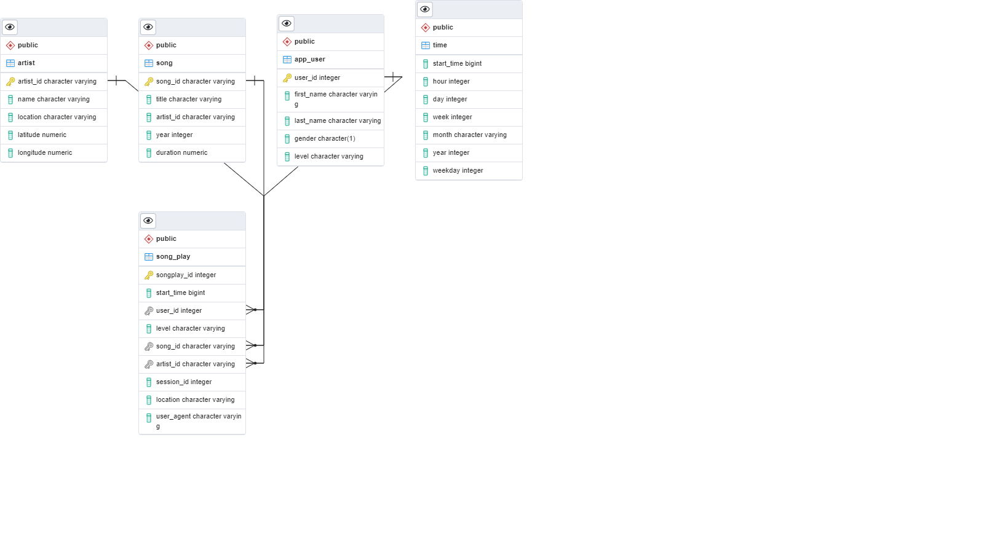

# **SUMMARY**

The purpose of this project is to analyze sparkify user activity to gain insights about songs in the sparkify catalogue.
We'll do so by creating a data model in PostgreSQL using python's PostgreSQL database adapter, and loading that data model with user activity and song data extracted from user activity logs and song metadata files.
Once the schema has been created and the user activity and song metadata have been inserted into it, the project should be ready to test by running some queries from the analytics team against it.

An ER diagram of the datamodel can be seen 
The song, artist, and app_user tables are dimension tables.
The song_plays table is a fact table which contains foreign keys that relate it to song, artist, and app_user.
The time table is weird since its just a timestamp with extrapolated information repeating the same thing.
Therefore, i don't believe it really needs to relate to anything by way of primary/foreign key relationship yet.

# **INSTRUCTIONS**

1. Open a terminal
2. Ensure your currently active python environment has the Postgres database adapter installed (psycopg2). It should be displayed if you call pip freeze from the terminal.
3. Change directory to the top level directory for this project.
4. Call "python create_tables.py" from the terminal
5. Call "python etl.py" from the terminal
6. (bonus) After running etl.py, if pytest is installed in the environment, you should be able to run the "pytest tests" from the terminal to verify the proper number of entities were loaded into each table and that entities were loaded with the correct data.

# **MANIFEST**

- _data_: A directory containing user activity log data and song metadata in json format
- _create_tables.py_: python script for resetting tables before beginning running other scripts in this project
- _etl.ipynb_: notebook file practicing data extraction from user activity and song metadata files. code from here will be ported over to etl.py after we confirm that it works.
- _etl.py_: extracts data from song_data and log_data files and loads it into project database tables
- _README.md_: this file
- _sql_queries.py_: python file containing frequently used SQL queries
- _test.ipynb_: notebook file for viewing tables that were filled out by executing etl.ipynb
